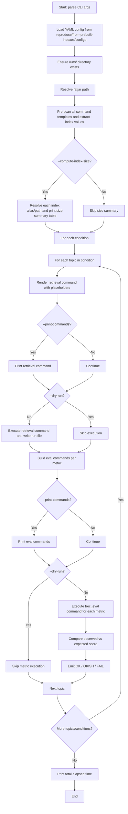

# Automated Regressions from Prebuilt Indexes

This page describes the high-level pipeline implemented by `io.anserini.reproduce.RunRegressionFromPrebuiltIndexes`.

Unlike `run_regression.py` workflows that build indexes from raw corpora, this pipeline assumes indexes already exist as **prebuilt indexes** (or local index paths) and focuses on:

- Running retrieval commands for each configured condition/topic pair.
- Evaluating outputs with `trec_eval`.
- Comparing measured metrics against expected regression targets.

## Entry Point

Run via fatjar wrapper:

```bash
bin/run.sh io.anserini.reproduce.RunRegressionFromPrebuiltIndexes \
  --regression msmarco-v1-passage.core
```

Key flags:

- `--regression [config]` (required): YAML name in `src/main/resources/reproduce/from-prebuilt-indexes/configs/`.
- `--print-commands`: print retrieval and eval commands.
- `--dry-run`: skip command execution.
- `--compute-index-size`: pre-scan unique `-index` references and print disk/download size summary.

## Config Model

The YAML config contains:

- `conditions[]`: each with a `name`, display metadata, and a retrieval `command` template.
- `topics[]` under each condition.
- `topic_key`: topic set identifier passed into search command.
- `eval_key`: qrels key for `trec_eval`.
- `expected_scores`: expected metric values.
- `metric_definitions`: `trec_eval` flag string for each metric.

Command templates use placeholders:

- `$fatjar`: resolved from runtime location of the current jar.
- `$threads`: currently fixed to `16`.
- `$topics`: topic key from config.
- `$output`: run file path under `runs/`.

## Pipeline



## Evaluation Semantics

For each metric in `expected_scores`:

- Build eval command: `java -cp <fatjar> trec_eval <metric_definition> <eval_key> <output>`.
- Parse returned score.
- Compare against expected value.
- Higher than expected: `OKISH`.
- Exact (within `1e-5`): `OK`.
- Small deviation (within `2e-4`): `OKISH`.
- Otherwise: `FAIL`.

## Outputs

- Run files: `runs/run.<regression>.<condition>.<topic>.txt`
- Console logs with condition/topic progress.
- Optional index-size table.
- Optional command echo.
- Metric-by-metric regression checks.
- Final total runtime.
