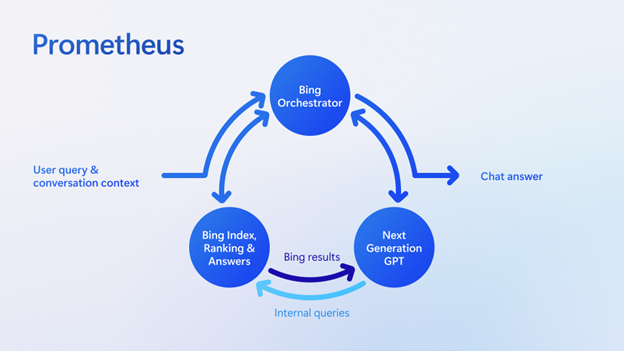

# Anserini: Start Here

This page provides the entry point for an introduction to information retrieval (i.e., search).
It also serves as an [onboarding path](https://github.com/castorini/onboarding) for University of Waterloo undergraduate and graduate students who wish to join my research group.

As a high-level tip for anyone going through these exercises: try to understand what you're actually doing, instead of simply [cargo culting](https://en.wikipedia.org/wiki/Cargo_cult_programming) (i.e., blindly copying and pasting commands into a shell).
By this, I mean, actually _read_ the surrounding explanations, understand the purpose of the commands, and use this guide as a springboard for additional explorations (for example, dig deeper into the code).

**Learning outcomes** for this guide:

+ Understand the definition of the retrieval problem in terms of the core concepts of queries, collections, and relevance.
+ Understand at a high level how retrieval systems are evaluated with queries and relevance judgments.
+ Download the MS MARCO passage ranking test collection and perform basic manipulations on the downloaded files.
+ Connect the contents of specific files in the download package to the concepts referenced above.

## The Retrieval Problem

Let's start at the top:
What's the problem we're trying to solve?

This is the definition I typically give:

> Given an information need expressed as a query _q_, the text retrieval task is to return a ranked list of _k_ texts {_d<sub>1</sub>_, _d<sub>2</sub>_ ... _d<sub>k</sub>_} from an arbitrarily large but finite collection
of texts _C_ = {_d<sub>i</sub>_} that maximizes a metric of interest, for example, nDCG, AP, etc.

This problem has been given various names, e.g., the search problem, the information retrieval problem, the text ranking problem, the top-_k_ document retrieval problem, etc.
In most contexts, "ranking" and "retrieval" are used interchangeably.
Basically, this is what _search_ (i.e., information retrieval) is all about.

## Interlude: Who Cares?

At this point, it's worthwhile to pause and answer the question: Who cares?

LLMs are cool.
ChatGPT is cool.
Generative AI is cool.
But _search_?
That's so... last millennium!

Well, not quite.
You might have heard of this thing called "retrieval augmentation"?
That's just a fancy way of describing the technique of fetching pieces of content (e.g., paragraphs) from some external source (e.g., a collection of documents), and stuffing them into the prompt of an LLM to improve its generative capabilities.
How do we "fetch" those pieces of content?
Well, that's retrieval!
(You might have also heard about something called vector search? We'll cover exactly that later in this onboarding path.)

In fact, retrieval augmentation is exactly how the new Bing search works.
You don't have to take my word: you can directly read the blog post on [building the new Bing](https://blogs.bing.com/search-quality-insights/february-2023/Building-the-New-Bing) and find the following diagram:



Search comprises "internal queries" to fetch content ("Bing results") that are then fed into an LLM (i.e., stuffed into the prompt) to generate answers.
If you want more evidence, here's a [NeurIPS 2020 paper](https://arxiv.org/abs/2005.11401) that basically says the same thing.

Thus, retrieval forms the foundation of answer generation with LLMs.
In fact, it's critical to the quality of the output.
We all know the adage "[garbage in, garbage out](https://en.wikipedia.org/wiki/Garbage_in,_garbage_out)", which highlights the importance of retrieval.
If the retrieval quality ain't good, the LLM output will be garbage.

How do we do retrieval effectively?
Well, that's why you should read on.
Later, we'll also see that transformers (the same neural network model that underlies LLMs) form a fundamental building block of converting content into representation vectors (called "embeddings"), which underlie vector search.

## Back to the Retrieval Problem

Hopefully, you're convinced that retrieval is important, or at least sufficiently so to read on.
Now, let's get back to the retrieval problem and try to unpack the definition a bit.

A **"query"** is a representation of an information need (i.e., the reason you're looking for information in the first place) that serves as the input to a retrieval system.

The **"collection"** is what you're retrieving from (i.e., searching).
Some people say "corpus" (plural, "corpora", not "corpuses"), but the terms are used interchangeably.
A "collection" or "corpus" comprises "documents".
In standard parlance, a "document" is used generically to refer to any discrete information object that can be retrieved.
We call them "documents" even though in reality they may be webpages, passages, PDFs, Powerpoint slides, Excel spreadsheets, or even images, audio, or video.

The output of retrieval is a ranking of documents (i.e., a ranked list, or just a sorted list).
Documents are identified by unique ids, and so a ranking is simply a list of ids.
The document contents can serve as input to downstream processing, e.g., fed into the prompt of a large language model as part of retrieval augmentation or generative question answering.

**Relevance** is perhaps the most important concept in information retrieval.
The literature on relevance goes back at least fifty years and the notion is (surprisingly) difficult to pin down precisely.
However, at an intuitive level, relevance is a relationship between an information need and a document, i.e., is this document relevant to this information need?
Something like, "does this document contain the information I'm looking for?"

Sweeping away a lot of complexity... relevance can be binary (i.e., not relevant, relevant) or "graded" (think Likert scale, e.g., not relevant, relevant, highly relevant).

## The Evaluation Problem

How do you know if a retrieval system is returning good results?
How do you know if _this_ retrieval system is better than _that_ retrieval system?

Well, imagine if you had a list of "real-world" queries, and someone told you which documents were relevant to which queries.
Amazingly, these artifacts exist, and they're called **relevance judgments** or **qrels**.
Conceptually, they're triples along these lines:

```
q1 doc23 0
q1 doc452 1
q1 doc536 0
q2 doc97 0
...
```

That is, for `q1`, `doc23` is not relevant, `doc452` is relevant, and `doc536` is not relevant; for `q2`, `doc97` is not relevant...

Now, given a set of queries, you feed each query into your retrieval system and get back a ranked list of document ids.

The final thing you need is a **metric** that quantifies the "goodness" of the ranked list.
One easy-to-understand metric is precision at 10, often written P@10.
It simply means: of the top 10 documents, what fraction are relevant according to your qrels?
For a query, if five of them are relevant, you get a score of 0.5; if nine of them are relevant, you get a score of 0.9.
You compute P@10 per query, and then average across all queries.

Information retrieval researchers have dozens of metrics, but a detailed explanation of each isn't important right now... 
just recognize that _all_ metrics are imperfect, but they try to capture different aspects of the quality of a ranked list in terms of containing relevant documents.
For nearly all metrics, though, higher is better.

So now with a metric, we have the ability to measure (i.e., quantify) the quality of a system's output.
And with that, we have the ability to compare the quality of two different systems or two model variants.

With a metric, we have the ability to iterate incrementally and build better retrieval systems (e.g., with machine learning).
Oversimplifying (of course), information retrieval is all about making the metric go up.

Oh, where do these magical relevance judgments (qrels) come from?
Well, that's the story for another day...

<details>
<summary>Additional readings...</summary>

This is a very high-level summary of core concepts in information retrieval.
More nuanced explanations are presented in our book [Pretrained Transformers for Text Ranking: BERT and Beyond](
https://link.springer.com/book/10.1007/978-3-031-02181-7).
If you can access the book (e.g., via your university), then please do, since it helps get our page views up.
However, if you're paywalled, a pre-publication version is available [on arXiv](https://arxiv.org/abs/2010.06467) for free.

The parts you'll want to read are Section 1.1 "Text Ranking Problems" and all of Chapter 2 "Setting the Stage".

When should you do these readings?
That's a good question:
If you absolutely want to know more _right now_, then go for it.
Otherwise, I think it's probably okay to continue along the onboarding path... although you'll need to circle back and get a deeper understanding of these concepts if you want to get into information retrieval research "more seriously".
</details>

## A Tour of MS MARCO

Bringing together everything we've discussed so far, a test collection consists of three elements:

+ a collection (or corpus) of documents
+ a set of queries
+ relevance judgments (or qrels), which tell us which documents are relevant to which queries

Here, we're going to introduce the [MS MARCO passage ranking test collection](https://microsoft.github.io/msmarco/).

If you haven't cloned the [anserini](https://github.com/castorini/anserini) repository already, clone it and get its `tools` submodule:
```bash
git clone https://github.com/castorini/anserini.git
cd anserini
git submodule update --init --recursive
```

In these instructions we're going to use Anserini's root directory as the working directory.
First, we need to download and extract the data:

```bash
mkdir collections/msmarco-passage

wget https://msmarco.z22.web.core.windows.net/msmarcoranking/collectionandqueries.tar.gz -P collections/msmarco-passage

# Alternative mirror:
# wget https://rgw.cs.uwaterloo.ca/JIMMYLIN-bucket0/data/collectionandqueries.tar.gz -P collections/msmarco-passage

tar xvfz collections/msmarco-passage/collectionandqueries.tar.gz -C collections/msmarco-passage
```

To confirm, `collectionandqueries.tar.gz` should have MD5 checksum of `31644046b18952c1386cd4564ba2ae69`.

If you peak inside the collection:

```bash
head collections/msmarco-passage/collection.tsv
```

You'll see that `collection.tsv` contains the documents that we're searching.
Note that generically we call them "documents" but in truth they are passages; we'll use the terms interchangeably.

Each line represents a passage:
the first column contains a unique identifier for the passage (called the `docid`) and the second column contains the text of the passage itself.

Next, we need to do a bit of data munging to get the collection into something Anserini can easily work with, which is a jsonl format (where we have one json object per line):

```bash
python tools/scripts/msmarco/convert_collection_to_jsonl.py \
  --collection-path collections/msmarco-passage/collection.tsv \
  --output-folder collections/msmarco-passage/collection_jsonl
```

The above script should generate 9 jsonl files in `collections/msmarco-passage/collection_jsonl`, each with 1M lines (except for the last one, which should have 841,823 lines).
Look inside a file to see the json format we use.
The entire collection is now something like this:

```bash
$ wc collections/msmarco-passage/collection_jsonl/* 
 1000000 58716381 374524070 collections/msmarco-passage/collection_jsonl/docs00.json
 1000000 59072018 377845773 collections/msmarco-passage/collection_jsonl/docs01.json
 1000000 58895092 375856044 collections/msmarco-passage/collection_jsonl/docs02.json
 1000000 59277129 377452947 collections/msmarco-passage/collection_jsonl/docs03.json
 1000000 59408028 378277584 collections/msmarco-passage/collection_jsonl/docs04.json
 1000000 60659246 383758389 collections/msmarco-passage/collection_jsonl/docs05.json
 1000000 63196730 400184520 collections/msmarco-passage/collection_jsonl/docs06.json
 1000000 56920456 364726419 collections/msmarco-passage/collection_jsonl/docs07.json
  841823 47767342 306155721 collections/msmarco-passage/collection_jsonl/docs08.json
 8841823 523912422 3338781467 total
```

As an aside, data munging along these lines is a very common data preparation operation.
Collections rarely come in _exactly_ the format that your tools expect, so you'll be frequently writing lots of small scripts that munge data to convert from one format to another.

Similarly, we'll also have to do a bit of data munging of the queries and the qrels.
We're going to retain only the queries that are in the qrels file: 

```bash
python tools/scripts/msmarco/filter_queries.py \
  --qrels collections/msmarco-passage/qrels.dev.small.tsv \
  --queries collections/msmarco-passage/queries.dev.tsv \
  --output collections/msmarco-passage/queries.dev.small.tsv
```

The output queries file `collections/msmarco-passage/queries.dev.small.tsv` should contain 6980 lines.
Verify with `wc`.

Check out its contents:

```bash
$ head collections/msmarco-passage/queries.dev.small.tsv
1048585	what is paula deen's brother
2	 Androgen receptor define
524332	treating tension headaches without medication
1048642	what is paranoid sc
524447	treatment of varicose veins in legs
786674	what is prime rate in canada
1048876	who plays young dr mallard on ncis
1048917	what is operating system misconfiguration
786786	what is priority pass
524699	tricare service number
```

These are the queries in the development set of the MS MARCO passage ranking test collection.
The first field is a unique identifier for the query (called the `qid`) and the second column is the query itself.
These queries are taken from Bing search logs, so they're "realistic" web queries in that they may be ambiguous, contain typos, etc.

Okay, let's now cross-reference the `qid` with the relevance judgments, i.e., the qrels file:

```bash
$ grep 1048585 collections/msmarco-passage/qrels.dev.small.tsv 
1048585	0	7187158	1
```

The above is the standard format for a qrels file.
The first column is the `qid`;
the second column is (almost) always 0 (it's a historical artifact dating back decades);
the third column is a `docid`;
the fourth column provides the relevance judgment itself.
In this case, 0 means "not relevant" and 1 means "relevant".
So, this entry says that the document with id 7187158 is relevant to the query with id 1048585. Note that from the `head` command above, `qid` 1048585 corresponds to the query "what is paula deen's brother".

Well, how do we get the actual contents of document 7187158?
The simplest way is to grep through the collection itself:

```bash
$ grep 7187158 collections/msmarco-passage/collection.tsv
7187158	Paula Deen and her brother Earl W. Bubba Hiers are being sued by a former general manager at Uncle Bubba's… Paula Deen and her brother Earl W. Bubba Hiers are being sued by a former general manager at Uncle Bubba's…
```

We see here that, indeed, the passage above is relevant to the query (i.e., provides information that answers the question).
Note that this particular passage is a bit dirty (garbage characters, dups, etc.)... but that's pretty much a fact of life when you're dealing with the web.

Before proceeding, try the same thing with a few more queries: map the queries to the relevance judgments to the actual documents.

How big is the MS MARCO passage ranking test collection, btw?
Well, we've just seen that there are 6980 training queries.
For those, we have 7437 relevance judgments:

```bash
$ wc collections/msmarco-passage/qrels.dev.small.tsv  
7437   29748  143300 collections/msmarco-passage/qrels.dev.small.tsv
````

This means that we have only about one relevance judgments per query.
We call these **sparse judgments**, i.e., where we have relatively few relevance judgments per query (here, just about one relevance judgment per query).
In other cases, where we have many relevance judgments per query (potentially hundreds or even more), we call those **dense judgments**.
There are important implications when using sparse vs. dense judgments, but that's for another time...

This is just looking at the development set.
Now let's look at the training set:

```bash
$ wc collections/msmarco-passage/qrels.train.tsv               
532761 2131044 10589532 collections/msmarco-passage/qrels.train.tsv
```

Wow, there are over 532k relevance judgments in the dataset!
(Yes, that's big!)
It's sufficient... for example... to _train_ neural networks (transformers) to perform retrieval!
And, indeed, MS MARCO is perhaps the most common starting point for work in building neural retrieval models.
But that's for some other time....

Okay, go back and look at the learning outcomes at the top of this page.
By now you should be able to connect the concepts we introduced to how they manifest in the MS MARCO passage ranking test collection.

From here, you're now ready to proceed to try and reproduce the [BM25 Baselines for MS MARCO Passage Ranking
](experiments-msmarco-passage.md).

Before you move on, however, add an entry in the "Reproduction Log" at the bottom of this page, following the same format: use `yyyy-mm-dd`, make sure you're using a commit id that's on the main trunk of Anserini, and use its 7-hexadecimal prefix for the link anchor text.
In the description of your pull request, please provide some details on your setup (e.g., operating system, environment and configuration, etc.).
In addition, also provide some indication of success (e.g., everything worked) or document issues you encountered.
If you think this guide can be improved in any way (e.g., you caught a typo or think a clarification is warranted), feel free to include it in the pull request.

## Reproduction Log[*](reproducibility.md)

+ Results reproduced by [@sahel-sh](https://github.com/sahel-sh) on 2023-07-21 (commit [`0e759fd`](https://github.com/castorini/anserini/commit/0e759fd3b9161a24f66c56e07f73f16eaf1490c6))
+ Results reproduced by [@Mofetoluwa](https://github.com/Mofetoluwa) on 2023-08-03 (commit [`7314128`](https://github.com/castorini/anserini/commit/73141282b62979e189ac3c87d9a902064f34a1c5))
+ Results reproduced by [@yilinjz](https://github.com/yilinjz) on 2023-08-23 (commit [`862bd27`](https://github.com/castorini/anserini/commit/862bd27d5c1400763e11424a7d44dcbf4cf48c17))
+ Results reproduced by [@Andrwyl](https://github.com/Andrwyl) on 2023-08-26 (commit [`b64a412`](https://github.com/castorini/anserini/commit/b64a412453d0fee1b89179d3b665984651a8b8f8))
+ Results reproduced by [@UShivani3](https://github.com/UShivani3) on 2023-08-29 (commit [`24ab292`](https://github.com/castorini/anserini/commit/24ab292c5eaaccd40bbfa13fa7122eeb58261aaa))
+ Results reproduced by [@lucedes27](https://github.com/lucedes27) on 2023-09-03 (commit [`211e74f`](https://github.com/castorini/anserini/commit/211e74f1453b2b100c03ac78d2a130b07b19b780))
+ Results reproduced by [@mchlp](https://github.com/mchlp) on 2023-09-03 (commit [`211e74f`](https://github.com/castorini/anserini/commit/211e74f1453b2b100c03ac78d2a130b07b19b780))
+ Results reproduced by [@Edward-J-Xu](https://github.com/Edward-J-Xu) on 2023-09-04 (commit [`6030b1`](https://github.com/castorini/anserini/commit/6030b1886d3b501c69f258f9f716508bf7fb80ff))
+ Results reproduced by [@Sumon-Kanti-Dey](https://github.com/SumonKantiDey) on 2023-09-04 (commit [`a9de13a`](https://github.com/castorini/anserini/commit/a9de13a81194189bbbffa39d294acd59372229a6))
+ Results reproduced by [@MojTabaa4](https://github.com/MojTabaa4) on 2023-09-13 (commit [`adf480b`](https://github.com/castorini/anserini/commit/ae6ff62f1830f8e3f38199a7d8f723940a62fb28))
+ Results reproduced by [@Kshama](https://github.com/Kshama33) on 2023-09-17 (commit [`f27984b`](https://github.com/castorini/anserini/commit/f27984be65c3ff34f273241d7bf82b23d3708ccb))
+ Results reproduced by [@MelvinMo](https://github.com/MelvinMo) on 2023-09-23 (commit [`21efc3f`](https://github.com/castorini/anserini/commit/21efc3fed8b65c2cfc0512fa4772aafffbcefe76))
+ Results reproduced by [@dourian](https://github.com/dourian) on 2023-09-24 (commit [`88935fc`](https://github.com/castorini/anserini/commit/88935fc9431dbb81d55883547c185c4d1f44bf36))
+ Results reproduced by [@ksunisth](https://github.com/ksunisth) on 2023-09-27 (commit [`7c95d91`](https://github.com/castorini/anserini/commit/7c95d9155e59cfc55c573139b3538cc76d0f5371))
+ Results reproduced by [@maizerrr](https://github.com/maizerrr) on 2023-10-01 (commit [`2abdd37`](https://github.com/castorini/anserini/commit/2abdd373d70ae64ff6638c3440d7f0063514d313))
+ Results reproduced by [@Seun-Ajayi](https://github.com/Seun-Ajayi) on 2023-10-05 (commit [`f5f5050`](https://github.com/castorini/anserini/commit/f5f505087f188d2a82de04108bebe746ef7c141b))
+ Results reproduced by [@gituserbs](https://github.com/gituserbs) on 2023-10-07 (commit [`d88003c`](https://github.com/castorini/anserini/commit/d88003c71ae7b2e3da65885c709f61aac57611b4))
+ Results reproduced by [@shayanbali](https://github.com/shayanbali) on 2023-10-12 (commit [`8194b8e`](https://github.com/castorini/anserini/commit/8194b8e91fe799fcb0d3b4348e9d710a0aa1ad26))
+ Results reproduced by [@oscarbelda86](https://github.com/oscarbelda86) on 2023-10-30 (commit [`824154b`](https://github.com/castorini/anserini/commit/824154bf9226b2f44146a5b258f0dfb2042eb583))
+ Results reproduced by [@shakibaam](https://github.com/shakibaam) on 2023-11-01 (commit [`2f3e7d5`](https://github.com/castorini/anserini/commit/2f3e7d50ef87a687f519ec0c4874807845a71078))
+ Results reproduced by [@gitHubAndyLee2020](https://github.com/gitHubAndyLee2020) on 2023-11-02 (commit [`2f3e7d5`](https://github.com/castorini/anserini/commit/2f3e7d50ef87a687f519ec0c4874807845a71078))
+ Results reproduced by [@Melissa1412](https://github.com/Melissa1412) on 2023-11-04 (commit [`cf459b3`](https://github.com/castorini/anserini/commit/cf459b39ecc2c92a400210a9ba84736bdb5d4422))
+ Results reproduced by [@aliranjbari](https://github.com/AliRanjbari) on 2023-11-05 (commit [`f053e81`](https://github.com/AliRanjbari/anserini/commit/f053e81f1c9343863b613c03fe722a091033d7b8))
+ Results reproduced by [@salinaria](https://github.com/salinaria) on 2023-11-08 (commit [`75c553f`](https://github.com/castorini/anserini/commit/75c553fd9d31390adb4ceedda0da5730a0a34ec0))
+ Results reproduced by [@golnooshasefi](https://github.com/golnooshasefi) on 2023-11-21 (commit [`6369184`](https://github.com/castorini/anserini/commit/6369184625c84dfa45b775ddedeb2bc31ceb84c7))
+ Results reproduced by [@alimt1992](https://github.com/alimt1992) on 2023-11-24 (commit [`ae498aa`](https://github.com/castorini/anserini/commit/ae498aa997155945ff24adb45454183e5afe93d9))
+ Results reproduced by [@AndreSlavescu](https://github.com/AndreSlavescu) on 2023-11-27 (commit [`3435e8a`](https://github.com/castorini/anserini/commit/3435e8a76360f6803c825ff07deeecf389ac9278))
+ Results reproduced by [@tudou0002](https://github.com/tudou0002) on 2023-11-28 (commit [`2748548`](https://github.com/castorini/anserini/commit/27485486229bdc9d5f2bfaed594ca47f0b32b5b3))
+ Results reproduced by [@sueszli](https://github.com/sueszli) on 2023-11-30 (commit [`d076892`](https://github.com/castorini/anserini/commit/d0768920233b73c6a5b208a86ffa8668735c1b14))
+ Results reproduced by [@kdricci](https://github.com/kdricci) on 2023-12-01 (commit [`d076892`](https://github.com/castorini/anserini/commit/d0768920233b73c6a5b208a86ffa8668735c1b14))
+ Results reproduced by [@AreelKhan](https://github.com/AreelKhan) on 2023-12-02 (commit [`470207a`](https://github.com/castorini/anserini/commit/470207ae2b3e2976027c0b68828876abb85770e1))
+ Results reproduced by [@ljk423](https://github.com/ljk423) on 2023-12-02 (commit [`acb1076`](https://github.com/castorini/anserini/commit/acb1076f6cf92fc468360f5dfccdef4f848dca62))
+ Results reproduced by [@Minhajul99](https://github.com/Minhajul99) on 2023-12-09 (commit [`f1d6320`](https://github.com/castorini/anserini/commit/f1d6320a0002faeec28f3262cc5bf982c992503b))
+ Results reproduced by [@Panizghi](https://github.com/Panizghi) on 2023-12-10 (commit [`9c4cecc`](https://github.com/castorini/anserini/commit/9c4ceccffb516d718c886072ce0c106b6dd06cb3))
+ Results reproduced by [@saharsamr](https://github.com/saharsamr) on 2023-12-14 (commit [`b6a7534`](https://github.com/castorini/anserini/commit/b6a7534df199a467407dbfd1f6a1da192969066d))
+ Results reproduced by [@wu-ming233](https://github.com/wu-ming233) on 2023-12-30 (commit [`2ebc11c`](https://github.com/castorini/anserini/commit/2ebc11c961e49cf3272593d58b594cdac580946e))
+ Results reproduced by [@Yuan-Hou](https://github.com/Yuan-Hou) on 2024-01-02 (commit [`1ebe6dd`](https://github.com/castorini/anserini/commit/1ebe6dda261218b5a1481dcfeaeb47cfc83d0292))
+ Results reproduced by [@himasheth](https://github.com/himasheth) on 2024-01-08 (commit [`1ebe6dd`](https://github.com/castorini/anserini/commit/1ebe6dda261218b5a1481dcfeaeb47cfc83d0292))
+ Results reproduced by [@Tanngent](https://github.com/Tanngent) on 2024-01-13 (commit [`ebde6bc`](https://github.com/castorini/anserini/commit/ebde6bc3faaf0406d5441d2ff480ba3efc43b9e8))
+ Results reproduced by [@BeginningGradeMaker](https://github.com/BeginningGradeMaker) on 2024-01-15 (commit [`85fad8d`](https://github.com/castorini/anserini/commit/85fad8d9a3aa797b12362894e40aa00041bf3664))
+ Results reproduced by [@ia03](https://github.com/ia03) on 2024-01-17 (commit [`85fad8d`](https://github.com/castorini/anserini/commit/85fad8d9a3aa797b12362894e40aa00041bf3664))
+ Results reproduced by [@AlexStan0](https://github.com/AlexStan0) on 2024-01-19 (commit [`edd47ad`](https://github.com/castorini/anserini/commit/edd47ad3b8d833fcf834bb50e9735f35f5d9b79b))
+ Results reproduced by [@charlie-liuu](https://github.com/charlie-liuu) on 2024-01-22 (commit [`ba472b8`](https://github.com/castorini/anserini/commit/ba472b801889acdc371c1dad78b2156c1620ce32))
+ Results reproduced by [@dannychn11](https://github.com/dannychn11) on 2024-01-27 (commit [`f02e6f1`](https://github.com/castorini/anserini/commit/f02e6f1dd6375d2f513656a7f70aeaf63cf67f4e))
+ Results reproduced by [@chloeqxq](https://github.com/chloeqxq) on 2024-01-28 (commit [`3f2d7fa`](https://github.com/castorini/anserini/commit/3f2d7fa91118b71d75d9f547d19ff19858f96523))
+ Results reproduced by [@16BitNarwhal](https://github.com/16BitNarwhal) on 2024-02-17 (commit [`5c110dc`](https://github.com/castorini/anserini/commit/5c110dcf970f14e1ee271699ba972ded588d822c))
+ Results reproduced by [@ru5h16h](https://github.com/ru5h16h) on 2024-02-19 (commit [`43c9ecc`](https://github.com/castorini/anserini/commit/43c9ecca53313ec2f84c8274d88f99ca3ea2e4bd))
+ Results reproduced by [@ASChampOmega](https://github.com/ASChampOmega) on 2024-02-23 (commit [`f0b37dd`](https://github.com/castorini/anserini/commit/f0b37dd28ffec543a9ef107a52297b30199b69f1))
+ Results reproduced by [@17Melissa](https://github.com/17Melissa) on 2024-02-23 (commit [`084deb9`](https://github.com/castorini/anserini/commit/084deb97fe886b9062d005edcdc3982b2e65ce3f))
+ Results reproduced by [@HaeriAmin](https://github.com/haeriamin) on 2024-02-26 (commit [`e91cd20`](https://github.com/castorini/anserini/commit/e91cd205230cbb04c14f71eee276511ea1f1316a))
+ Results reproduced by [@devesh-002](https://github.com/devesh-002) on 2024-03-05 (commit [`f86a65f`](https://github.com/castorini/anserini/commit/f86a65f43eb15d88b7a003a1edf541d9d60c3056))
+ Results reproduced by [@xpbowler](https://github.com/xpbowler) on 2024-03-11 (commit [`80c3bf9`](https://github.com/castorini/anserini/commit/80c3bf9a2d374c56b574ad7758f71ae597705cd5))
+ Results reproduced by [@jodyz0203](https://github.com/jodyz0203) on 2024-03-12 (commit [`f681d65`](https://github.com/castorini/anserini/commit/f681d6504b9f89f65697878c6c984840456f5d53))
+ Results reproduced by [@kxwtan](https://github.com/kxwtan) on 2024-03-12 (commit [`f681d65`](https://github.com/castorini/anserini/commit/f681d6504b9f89f65697878c6c984840456f5d53))
+ Results reproduced by [@khufia](https://github.com/khufia) on 2024-03-26 (commit [`f681d65`](https://github.com/castorini/anserini/commit/f681d6504b9f89f65697878c6c984840456f5d53))

